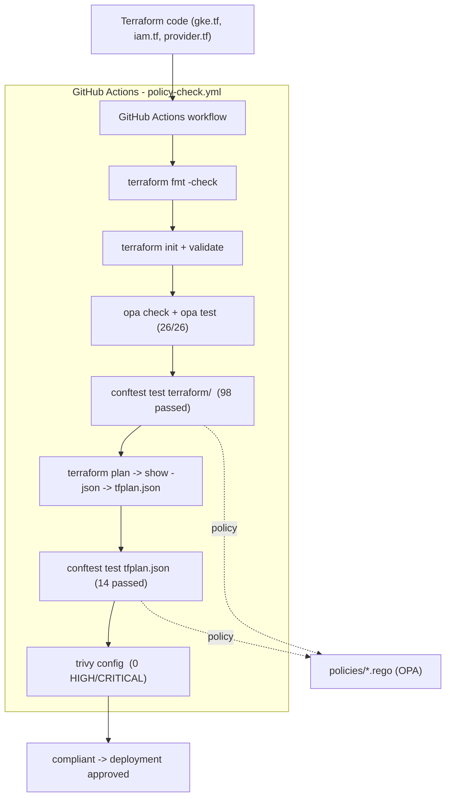

# Policy-as-Code Enforcement & Observability Platform

A GCP-native platform that enforces infrastructure policy automatically — catching non-compliant Terraform changes before they're applied, and giving visibility into infrastructure state and policy violations through a live observability layer.

Built by **Vurumu Mahesh (VM)** — Platform Engineering / SRE portfolio project.

---

## Architecture

Infrastructure changes can be checked against versioned policy before they touch real GCP resources. A planned observability layer will track what's running, so drift and violations can be visible in real time rather than only at commit time.



Simplified flow:

```
Terraform code pushed
        ↓
CI validates + policy-checks (dev scope here)
        ↓
OPA/Rego policies (via Conftest) check the plan for violations
        ↓
Trivy scans for Terraform security misconfigurations
        ↓
If compliant → infrastructure is ready for approved deployment on GCP
        ↓
Cloud Monitoring + Cloud Logging + Grafana observe it continuously (planned)
```

---

## Repository structure

```
gcp-policy-as-code/
├── .github/
│   └── workflows/
│       └── policy-check.yml      # CI: fmt → validate → OPA → Conftest → Trivy
├── policies/                     # Rego policy engine (eval'd together in package main)
│   ├── gke_security.rego         # private nodes, netpol, authorized nets, COS, metadata, SA
│   ├── labels.rego               # required resource labels
│   ├── firewall.rego             # blocks 0.0.0.0/0
│   ├── buckets.rego              # blocks public bucket IAM
│   ├── deletion.rego             # requires deletion protection
│   ├── machines.rego             # approved machine types
│   ├── _test_base.rego           # shared compliant fixtures
│   └── *_test.rego               # Rego unit tests (26/26 passing)
├── terraform/                    # infrastructure as code
│   ├── provider.tf               # google provider, reads terraform-key.json
│   ├── gke.tf                    # hardened private cluster + node pool
│   ├── iam.tf                    # dedicated node service account + roles
│   └── variables.tf              # master_authorized_cidr, etc.
├── tests/                        # plan JSON fixtures (policy smoke tests)
├── .gitignore                    # ignores terraform-key.json, *.tfstate, tfplan
└── README.md
```

---

## Project goal

Most Terraform pipelines validate syntax (`terraform validate`) but don't enforce *organizational rules* — things like "no public storage buckets," "only approved instance types," "every resource must have an owner tag." This project closes that gap by making policy versioned, testable, and enforceable before infrastructure reaches GCP.

---

## Technologies

| Layer | Tool | Purpose |
|---|---|---|
| **Infrastructure as Code** | Terraform | Defines and provisions GCP resources |
| **Policy engine** | OPA (Open Policy Agent) + Rego | Encodes the actual compliance rules |
| **Policy test runner** | Conftest | Runs Rego policies against Terraform plan output |
| **Security scanning** | Trivy (CI), tfsec (planned) | Catches security misconfigurations in Terraform code |
| **CI/CD** | GitHub Actions (this repo + companion pipeline) | Automates formatting, validation, policy checks, and security scanning |
| **Container orchestration** | Kubernetes (GKE) | Runs policy checks in isolated, reproducible Jobs |
| **Observability** | Cloud Monitoring, Cloud Logging, Grafana | Tracks infrastructure state, policy violations, and drift |
| **Cloud provider** | Google Cloud Platform | Where the actual infrastructure lives |

---

## Policy examples

Policies live in `policies/*.rego` and are all evaluated together in `package main`. Each rule emits a `deny` message when a change violates a project rule.

**Require labels on every cluster and node pool** — `policies/labels.rego`:

```rego
package main

required_labels := ["environment", "project", "managed_by"]

deny contains msg if {
    resource := input.planned_values.root_module.resources[_]
    resource.type == "google_container_cluster"
    some label in required_labels
    not resource.values.resource_labels[label]
    msg := sprintf("Cluster %s is missing required label: %s", [resource.address, label])
}
```

**Block firewalls open to the world** — `policies/firewall.rego`:

```rego
deny contains msg if {
    resource := input.planned_values.root_module.resources[_]
    resource.type == "google_compute_firewall"
    "0.0.0.0/0" in resource.values.source_ranges
    msg := sprintf("Firewall rule %s allows traffic from 0.0.0.0/0", [resource.address])
}
```

**Enforce GKE hardening** — `policies/gke_security.rego` checks private nodes, network policy, master authorized networks, `COS_CONTAINERD`, `GKE_METADATA`, a dedicated node service account, and auto-repair/auto-upgrade:

```rego
deny contains msg if {
    resource := input.planned_values.root_module.resources[_]
    resource.type == "google_container_node_pool"
    image := resource.values.node_config[0].image_type
    image != "COS_CONTAINERD"
    msg := sprintf("Node pool %s must use COS_CONTAINERD image, got %q", [resource.address, image])
}
```

The full rule set:

- Storage IAM members must not grant access to `allUsers` or `allAuthenticatedUsers` (`buckets.rego`).
- Firewall rules must not allow traffic from `0.0.0.0/0` (`firewall.rego`).
- Production clusters must enable deletion protection (`deletion.rego`).
- Clusters and node pools must carry `environment`, `project`, and `managed_by` labels (`labels.rego`).
- Node pools must use approved machine types (`machines.rego`).
- GKE clusters must use private nodes, network policy, and master authorized networks; node pools must use `COS_CONTAINERD`, `GKE_METADATA`, auto-repair, auto-upgrade, and a dedicated service account (`gke_security.rego`).

Each rule has a matching unit test in `policies/*_test.rego`, run with `opa test policies/` (currently 26/26 passing).

---

## CI pipeline

The repository workflow at [`.github/workflows/policy-check.yml`](.github/workflows/policy-check.yml) runs on pull requests and pushes to `main`:

1. Checks out the repository and installs Terraform, OPA, and Conftest.
2. Scans the Terraform directory with Trivy (`scan-type: config`).
3. Runs `terraform fmt -check`, `terraform init`, and `terraform validate`.
4. Runs `opa check` and `opa test` against all policies.
5. Runs Conftest against the Terraform configuration and a regenerated Terraform plan.

The workflow requires a `GOOGLE_CREDENTIALS` GitHub Actions secret and a valid `master_authorized_cidr` value for plan generation.

---

## Example policy checks

### Failed check

An open firewall rule is rejected by the policy gate:

```text
$ conftest test bad-firewall.json --policy policies/firewall.rego

FAIL - bad-firewall.json - main - Firewall rule google_compute_firewall.allow_all allows traffic from 0.0.0.0/0

1 test, 0 passed, 0 warnings, 1 failure, 0 exceptions
```

The change is blocked in CI before it can be applied.

### Successful check

A compliant, hardened plan passes every gate:

```text
$ conftest test policies/tfplan.json --policy policies/
14 tests, 14 passed, 0 warnings, 0 failures, 0 exceptions

$ opa test policies/
PASS: 26/26

$ trivy config --severity HIGH,CRITICAL terraform/
. | terraform | 0 | Clean (no security findings detected)
```

Run the checks locally with:

```bash
opa test policies/ -v
conftest test policies/tfplan.json --policy policies/
```

---

## Getting started

The Terraform configuration currently targets the `policy-as-code-platform` GCP project and is intended to be run from the `terraform/` directory.

Before running Terraform:

1. Provide Google Cloud credentials in `terraform/terraform-key.json`. This file is ignored by Git and must never be committed.
2. Set `master_authorized_cidr` to a trusted administrator CIDR. This controls access to the public GKE control-plane endpoint; do not use `0.0.0.0/0`.

```bash
cd terraform
# Replace the example CIDR with your trusted administrator IP/CIDR.
export TF_VAR_master_authorized_cidr="203.0.113.10/32"
terraform init
terraform plan
terraform apply
```

The cluster uses private nodes and a public control-plane endpoint restricted by the authorized CIDR. Review the plan carefully before applying it to GCP.

---

## Environments

This platform is built and run primarily in **`dev`** — real Terraform and policy checks are maintained against the `policy-as-code-platform` project. Cloud Monitoring, Cloud Logging, and Grafana integrations are still being wired up. Keeping this to one live environment avoids running 3x the infrastructure (and 3x the cost) for a portfolio-scale project.

The current Terraform labels target `dev` directly. Supporting additional environments (`staging`/`prod`) without duplicating configuration remains future work.

This repository includes a `.github/workflows/policy-check.yml` workflow for pull requests and pushes to `main`. The full multi-environment CI/CD *pipeline pattern* (staged approvals, wait timers, matrix builds across dev/staging/prod) is separately proven out in the companion repo: [GithubProjects-VM-](https://github.com/VurumuMahesh15/GithubProjects-VM-).

---

## Project status

🚧 **In active development** — build started August 21, 2026.

**Completed so far:**
- [x] GCP project provisioned (`policy-as-code-platform`)
- [x] Required APIs enabled (Compute, GKE, Monitoring, Logging, IAM, Resource Manager)
- [x] Terraform service account created with scoped IAM role
- [x] Budget alert configured on free trial credit
- [x] Repository-local GitHub Actions policy workflow runs Terraform, OPA, Conftest, and Trivy checks
- [x] Core CI/CD mechanism proven in the companion GitHub Actions pipeline — Kubernetes Job running Conftest/OPA policy checks against real Terraform inside a disposable cluster
- [x] Baseline GKE hardening defined in Terraform (private nodes, network policy, authorized control-plane CIDR, and dedicated node service account)
- [x] GKE security policy rules defined in Rego for private nodes, network policy, authorized networks, node image, metadata mode, upgrades, and service accounts
- [x] Rego unit tests added for baseline and GKE policies (`opa test`: 26/26 passing)
- [x] CI regenerates the Terraform plan and runs the complete policy gate against it
- [x] Real GCP infrastructure defined in Terraform
- [x] CI workflow hardened to fail with a clear message when `GOOGLE_CREDENTIALS` is missing
- [x] Project documented in the README (architecture, structure, policy examples, CI pipeline, example checks)

**In progress / planned:**
- [ ] Set the `GOOGLE_CREDENTIALS` secret in the GitHub repo so `terraform init`/`plan` succeed in CI (currently fails on a missing secret)
- [ ] Apply and verify the hardened GKE configuration and IAM bindings in the `dev` project
- [ ] Expand the Rego policy set beyond the current baseline and GKE rules (e.g. VPC, subnet, IAM, storage buckets)
- [ ] Return the GitHub Actions pipeline status badge to the README
- [ ] tfsec integrated into the pipeline
- [ ] Cloud Monitoring + Cloud Logging wired up
- [ ] Grafana dashboard deployed and connected
- [ ] (Later phase, ~1 month out) RAG-based natural-language interface over policy violations and logs, using Ollama + local embeddings

**Recent progress:** Documented the project in the README (architecture, policy examples, CI pipeline, example checks). Hardened the CI workflow so a missing `GOOGLE_CREDENTIALS` secret fails with a clear message instead of a confusing JSON parse error. The Kubernetes Job pipeline remains proven in the companion GitHub Actions pipeline (August 2026).

---

## Architecture decisions

- **GitHub Actions over Cloud Build** — keeps CI/CD in one familiar, portable system
- **tfsec over Checkov** — chosen for this project's security scanning
- **GCP-native Cloud Monitoring as Grafana's data source** — over self-hosting Prometheus, reducing operational overhead
- **Kubernetes Jobs for policy checks** — proves the enforcement mechanism works as a real cluster workload, not just a CI script, closer to how this would run in production

---

## Related project

This platform's CI/CD and policy-enforcement mechanics were first prototyped and debugged in a standalone practice repo: [GithubProjects-VM-](https://github.com/VurumuMahesh15/GithubProjects-VM-), under `ci-cd-k8s-policy-pipeline/`.

---

## Contact

**Vurumu Mahesh (VM)**
📧 [vgsvpmahesh@gmail.com](mailto:vgsvpmahesh@gmail.com)
🔗 [GitHub](https://github.com/VurumuMahesh15) · [LinkedIn](https://www.linkedin.com/in/vurumu-mahesh-ba572a293/)
