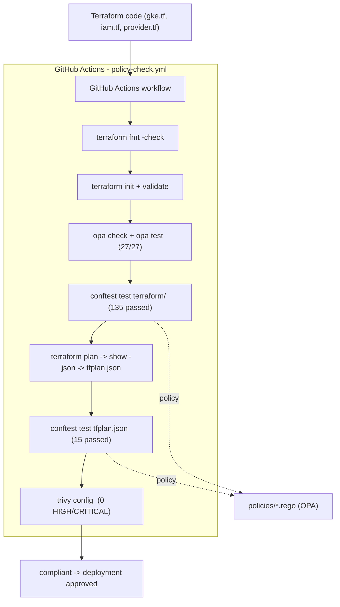

# Policy-as-Code Enforcement & Observability Platform

[](https://github.com/VurumuMahesh15/gcp-policy-as-code/actions/workflows/policy-check.yml)

A GCP-native platform that enforces infrastructure policy automatically — catching non-compliant Terraform changes before they're applied, and giving visibility into infrastructure state and policy violations through a live observability layer.

Built by **Vurumu Mahesh (VM)** — Platform Engineering / SRE portfolio project.

---

## Architecture

Infrastructure changes are checked against versioned policy before they touch real GCP resources. A live observability layer tracks what's running, so drift and violations are visible in real time — not only at commit time.



Simplified flow:

```
Terraform code pushed
        ↓
CI validates + policy-checks (dev scope here)
        ↓
OPA/Rego policies (via Conftest) check the plan for violations
        ↓
Trivy scans for Terraform security misconfigurations
        ↓
If compliant → infrastructure is ready for approved deployment on GCP
        ↓
Cloud Monitoring + Cloud Logging observe it continuously
        ↓
SRE runbooks guide incident response
        ↓
Chaos tests verify detection & recovery
```

---

## Repository structure

```
gcp-policy-as-code/
├── .github/
│   └── workflows/
│       └── policy-check.yml      # CI: fmt → validate → OPA → Conftest → Trivy
├── policies/                     # Rego policy engine (eval'd together in package main)
│   ├── gke_security.rego         # private nodes, netpol, authorized nets, no 0.0.0.0/0, COS, metadata, SA
│   ├── labels.rego               # required resource labels
│   ├── firewall.rego             # blocks 0.0.0.0/0
│   ├── buckets.rego              # blocks public bucket IAM
│   ├── deletion.rego             # requires deletion protection
│   ├── machines.rego             # approved machine types
│   ├── _test_base.rego           # shared compliant fixtures
│   └── *_test.rego               # Rego unit tests (27/27 passing)
├── terraform/                    # infrastructure as code
│   ├── provider.tf               # google provider, reads terraform-key.json
│   ├── gke.tf                    # hardened private cluster + node pool (kept, not applied — $0 cost)
│   ├── iam.tf                    # dedicated node service account + roles
│   ├── observability.tf          # Monitoring/Logging APIs + CPU alert policy
│   ├── dashboard.tf              # SRE Infrastructure Dashboard (GKE node + container CPU)
│   └── variables.tf              # master_authorized_cidr, etc.
├── chaos/                        # chaos experiment manifests
│   └── cpu-stress.yaml           # CPU stress workload for incident testing
├── docs/
│   ├── runbooks/
│   │   └── high-cpu.md           # SRE runbook: detect → investigate → remediate → verify
│   └── chaos-test-01-high-cpu.md # Chaos test report (alert fired, recovery verified)
├── tests/                        # static JSON fixtures for policy smoke tests
├── .gitignore                    # ignores terraform-key.json, *.tfstate, tfplan, tfvars
└── README.md
```

---

## Project goal

Most Terraform pipelines validate syntax (`terraform validate`) but don't enforce *organizational rules* — things like "no public storage buckets," "only approved instance types," "every resource must have an owner tag." This project closes that gap by making policy versioned, testable, and enforceable before infrastructure reaches GCP.

---

## Technologies

| Layer | Tool | Purpose |
|---|---|---|
| **Infrastructure as Code** | Terraform | Defines and provisions GCP resources |
| **Policy engine** | OPA (Open Policy Agent) + Rego | Encodes the actual compliance rules |
| **Policy test runner** | Conftest | Runs Rego policies against Terraform plan output |
| **Security scanning** | Trivy (CI) | Catches security misconfigurations in Terraform code |
| **CI/CD** | GitHub Actions (this repo + companion pipeline) | Automates formatting, validation, policy checks, and security scanning |
| **Container orchestration** | Kubernetes (GKE) | Runs policy checks in isolated, reproducible Jobs |
| **Observability** | Cloud Monitoring, Cloud Logging | Tracks infrastructure state, policy violations, and drift |
| **Cloud provider** | Google Cloud Platform | Where the actual infrastructure lives |

---

## Policy examples

Policies live in `policies/*.rego` and are all evaluated together in `package main`. Each rule emits a `deny` message when a change violates a project rule.

**Require labels on every cluster and node pool** — `policies/labels.rego`:

```rego
package main

required_labels := ["environment", "project", "managed_by"]

deny contains msg if {
    resource := input.planned_values.root_module.resources[_]
    resource.type == "google_container_cluster"
    some label in required_labels
    not resource.values.resource_labels[label]
    msg := sprintf("Cluster %s is missing required label: %s", [resource.address, label])
}
```

**Block firewalls open to the world** — `policies/firewall.rego`:

```rego
deny contains msg if {
    resource := input.planned_values.root_module.resources[_]
    resource.type == "google_compute_firewall"
    "0.0.0.0/0" in resource.values.source_ranges
    msg := sprintf("Firewall rule %s allows traffic from 0.0.0.0/0", [resource.address])
}
```

**Enforce GKE hardening** — `policies/gke_security.rego` checks private nodes, network policy, master authorized networks, `COS_CONTAINERD`, `GKE_METADATA`, a dedicated node service account, and auto-repair/auto-upgrade:

```rego
deny contains msg if {
    resource := input.planned_values.root_module.resources[_]
    resource.type == "google_container_node_pool"
    image := resource.values.node_config[0].image_type
    image != "COS_CONTAINERD"
    msg := sprintf("Node pool %s must use COS_CONTAINERD image, got %q", [resource.address, image])
}
```

**Block public GKE control-plane access** — `policies/gke_security.rego` explicitly rejects `0.0.0.0/0` in master authorized networks (added after a real gap was found — see Security verification below):

```rego
deny contains msg if {
    resource := input.planned_values.root_module.resources[_]
    resource.type == "google_container_cluster"
    cidrs := resource.values.master_authorized_networks_config[0].cidr_blocks
    some block in cidrs
    block.cidr_block == "0.0.0.0/0"
    msg := sprintf("Cluster %s must not allow 0.0.0.0/0 in master authorized networks", [resource.address])
}
```

The full rule set:

- Storage IAM members must not grant access to `allUsers` or `allAuthenticatedUsers` (`buckets.rego`).
- Firewall rules must not allow traffic from `0.0.0.0/0` (`firewall.rego`).
- Production clusters must enable deletion protection (`deletion.rego`).
- Clusters and node pools must carry `environment`, `project`, and `managed_by` labels (`labels.rego`).
- Node pools must use approved machine types (`machines.rego`).
- GKE clusters must use private nodes, network policy, and restricted master authorized networks (never `0.0.0.0/0`); node pools must use `COS_CONTAINERD`, `GKE_METADATA`, auto-repair, auto-upgrade, and a dedicated service account (`gke_security.rego`).

Each rule has a matching unit test in `policies/*_test.rego`, run with `opa test policies/` (currently 27/27 passing).

---

## CI pipeline

The repository workflow at [`.github/workflows/policy-check.yml`](.github/workflows/policy-check.yml) runs on pull requests and pushes to `main`:

1. Checks out the repository and installs Terraform, OPA, and Conftest.
2. Scans the Terraform directory with Trivy (`scan-type: config`, `HIGH,CRITICAL` fail the build).
3. Runs `terraform fmt -check`, `terraform init`, and `terraform validate`.
4. Runs `opa check` and `opa test` against all policies (27/27).
5. Runs Conftest against the Terraform configuration (`135 passed`) and a regenerated Terraform plan (`15 passed`).

The workflow uses a `GOOGLE_CREDENTIALS` GitHub Actions secret (service-account JSON, never committed) for `terraform init`/`plan`, and a safe RFC1918 fixture `TF_VAR_master_authorized_cidr=10.0.0.0/24` for plan generation — so CI tests the compliant path without exposing a real IP. Local `terraform/terraform.tfvars` (gitignored) holds the operator's real admin CIDR.

---

## Observability & SRE

The platform includes a live observability layer defined in `terraform/observability.tf` and `terraform/dashboard.tf`:

| Resource | Purpose |
|----------|---------|
| Cloud Monitoring API | Metrics collection and alerting |
| Cloud Logging API | Centralized log aggregation |
| Cloud Trace API | Distributed tracing |
| `google_monitoring_alert_policy.high_cpu` | Fires when GKE node CPU > 80% for 5 minutes |
| `google_monitoring_dashboard.sre_dashboard` | Live dashboard with GKE node + container CPU graphs |

**SRE workflow:**

```
GKE workload
     ↓
CPU increases
     ↓
Cloud Monitoring detects (>80% for 5min)
     ↓
Alert fires
     ↓
Engineer follows docs/runbooks/high-cpu.md
     ↓
Remediate → Verify recovery → Document
```

**Chaos tested:** See `docs/chaos-test-01-high-cpu.md` for the full incident report. A CPU stress workload pushed the node to 86%, the alert fired, the dashboard showed live data, and CPU recovered to 30% after workload removal.

---

## Example policy checks

### Failed check — open firewall

An open firewall rule is rejected by the policy gate:

```text
$ conftest test bad-firewall.json --policy policies/firewall.rego

FAIL - bad-firewall.json - main - Firewall rule google_compute_firewall.allow_all allows traffic from 0.0.0.0/0

1 test, 0 passed, 0 warnings, 1 failure, 0 exceptions
```

The change is blocked in CI before it can be applied.

### Failed check — public GKE control plane

A plan with `master_authorized_cidr=0.0.0.0/0` is rejected by the new `gke_security` rule:

```text
$ terraform plan -var="master_authorized_cidr=0.0.0.0/0" -out=/tmp/insecure.tfplan
$ terraform show -json /tmp/insecure.tfplan > /tmp/tfplan-insecure.json
$ conftest test /tmp/tfplan-insecure.json --policy policies/

FAIL - /tmp/tfplan-insecure.json - main - Cluster google_container_cluster.primary must not allow 0.0.0.0/0 in master authorized networks

15 tests, 14 passed, 0 warnings, 1 failure, 0 exceptions
```

### Successful check

A compliant, hardened plan passes every gate:

```text
$ conftest test policies/tfplan.json --policy policies/
15 tests, 15 passed, 0 warnings, 0 failures, 0 exceptions

$ opa test policies/
PASS: 27/27

$ trivy config --severity HIGH,CRITICAL terraform/
. | terraform | 0 | Clean (no security findings detected)
```

Run the checks locally with:

```bash
opa test policies/ -v
conftest test terraform/ --policy policies/
terraform plan -var="master_authorized_cidr=10.0.0.0/24" -out=/tmp/secure.tfplan
terraform show -json /tmp/secure.tfplan > /tmp/tfplan-secure.json
conftest test /tmp/tfplan-secure.json --policy policies/
```

---

## Security verification

The `0.0.0.0/0` control was added after a real gap was found: the old rule only checked `count(cidr_blocks) == 0`, so `0.0.0.0/0` passed as "one CIDR". Verified both ways:

| Test | Result |
|------|--------|
| `0.0.0.0/0` locally | ❌ Blocked (14 passed + 1 failure) |
| `0.0.0.0/0` in CI (#9 `a3fe49a`) | ❌ Blocked (pipeline failed as intended) |
| `10.0.0.0/24` locally | ✅ 15/15 |
| `10.0.0.0/24` in CI (#10 `c4dca6b`) | ✅ Passed |
| OPA/Conftest unit tests | ✅ 27/27 |
| Trivy | ✅ 0 HIGH/CRITICAL |

Note: `terraform/terraform.tfvars` overrides `TF_VAR_*` env vars locally, so local negative tests must use `-var="master_authorized_cidr=..."`. CI has no `tfvars` file (gitignored), so its `TF_VAR_master_authorized_cidr` fixture applies directly.

---

## Getting started

The Terraform configuration targets the `policy-as-code-platform` GCP project and is intended to be run from the `terraform/` directory.

Before running Terraform:

1. Provide Google Cloud credentials in `terraform/terraform-key.json`. This file is ignored by Git and must never be committed. The same JSON lives in the `GOOGLE_CREDENTIALS` Actions secret for CI.
2. Set `master_authorized_cidr` to a trusted administrator CIDR. This controls access to the GKE control-plane endpoint; do not use `0.0.0.0/0` — policy will block it.

```bash
cd terraform
# Local operator IP (gitignored tfvars). CI uses 10.0.0.0/24 as a safe fixture.
export TF_VAR_master_authorized_cidr="203.0.113.10/32"
terraform init
terraform plan
# terraform apply  # only when you intend to run real infra
```

The cluster definition uses private nodes and a control-plane endpoint restricted by the authorized CIDR. `terraform/gke.tf` is kept in the repo for reproducibility, but no cluster is currently applied — ongoing GKE compute cost is $0. Review the plan carefully before applying it to GCP.

---

## Environments

This platform is built and run primarily in **`dev`** — real Terraform and policy checks are maintained against the `policy-as-code-platform` project. Cloud Monitoring and Cloud Logging are live via Terraform. Keeping this to one live environment avoids running 3x the infrastructure (and 3x the cost) for a portfolio-scale project.

Cost control: the GKE cluster / node pool are currently destroyed (`terraform plan` shows `2 to add, 0 to change, 0 to destroy`). `terraform/gke.tf` stays in the repo so reviewers can see the infrastructure is reproducible without paying to keep it running. State-tracked live resources are the service account + IAM, Monitoring/Logging/Trace APIs, CPU alert, and dashboard — all negligible cost.

The current Terraform labels target `dev` directly. Supporting additional environments (`staging`/`prod`) without duplicating configuration remains future work.

This repository includes a `.github/workflows/policy-check.yml` workflow for pull requests and pushes to `main`. The full multi-environment CI/CD *pipeline pattern* (staged approvals, wait timers, matrix builds across dev/staging/prod) is separately proven out in the companion repo: [GithubProjects-VM-](https://github.com/VurumuMahesh15/GithubProjects-VM-).

---

## Project status

✅ **Policy-as-Code portion complete** — build started August 21, 2026. CI is green (`c4dca6b`), GKE cost is $0, policy gap closed with full verification.

**Completed:**
- [x] GCP project provisioned (`policy-as-code-platform`)
- [x] Required APIs enabled (Compute, GKE, Monitoring, Logging, IAM, Resource Manager)
- [x] Terraform service account created with scoped IAM role
- [x] Budget alert configured on free trial credit
- [x] GitHub Actions policy workflow runs Terraform, OPA, Conftest, and Trivy checks (badge above)
- [x] Core CI/CD mechanism proven in the companion GitHub Actions pipeline — Kubernetes Job running Conftest/OPA policy checks against real Terraform inside a disposable cluster
- [x] Baseline GKE hardening defined in Terraform (private nodes, network policy, authorized control-plane CIDR, and dedicated node service account)
- [x] GKE security policy rules defined in Rego for private nodes, network policy, authorized networks, node image, metadata mode, upgrades, and service accounts
- [x] Rego unit tests added for baseline and GKE policies (`opa test`: 27/27 passing)
- [x] CI regenerates the Terraform plan and runs the complete policy gate against it (`135 passed` on config, `15 passed` on plan)
- [x] Real GCP infrastructure defined in Terraform
- [x] CI workflow hardened to fail with a clear message when `GOOGLE_CREDENTIALS` is missing
- [x] `GOOGLE_CREDENTIALS` secret set — CI `init`/`plan` succeed (verified in run #10)
- [x] Project documented in the README (architecture, structure, policy examples, CI pipeline, example checks)
- [x] Cloud Monitoring + Cloud Logging APIs enabled via Terraform (`observability.tf`)
- [x] SRE Infrastructure Dashboard deployed (GKE node CPU + container CPU widgets)
- [x] High CPU alert policy configured (`kubernetes.io/node/cpu/allocatable_utilization` > 80% for 5min)
- [x] SRE runbook created (`docs/runbooks/high-cpu.md`): 9-step incident response procedure
- [x] Chaos test executed: CPU stress workload triggered alert, dashboard showed live data, recovery verified (86% → 30%)
- [x] Fixed observability bug: alert was monitoring `gce_instance` instead of `k8s_node` metric
- [x] Found + fixed policy gap: old rule allowed `0.0.0.0/0` in master authorized networks — added explicit deny + unit test (`a3fe49a`), proved block locally and in CI #9, fixed CI fixture to `10.0.0.0/24` (`c4dca6b`), CI #10 green
- [x] GKE reconciled + destroyed cleanly: no live cluster, state clean, `gke.tf` kept for reproducibility ($0 compute)

**In progress / planned:**
- [ ] tfsec evaluation — add only if it catches what Trivy misses (no duplicate signal)
- [ ] Grafana — add only if it adds value beyond Cloud Monitoring dashboard
- [ ] (Later phase, ~1 month out) RAG-based natural-language interface over policy violations and logs, using Ollama + local embeddings

**Recent progress:** Closed the `0.0.0.0/0` master-access gap end-to-end (policy + test + local negative/positive verification + CI #9 fail / #10 pass). Reconciled GKE to $0 while keeping config reproducible. CI badge live at top of this file.

---

## Architecture decisions

- **GitHub Actions over Cloud Build** — keeps CI/CD in one familiar, portable system
- **Trivy for config scanning (tfsec only if additive)** — avoids duplicate signal from two scanners doing the same job
- **GCP-native Cloud Monitoring (Grafana only if additive)** — over self-hosting Prometheus, reducing operational overhead
- **Kubernetes Jobs for policy checks** — proves the enforcement mechanism works as a real cluster workload, not just a CI script, closer to how this would run in production
- **Keep `gke.tf` without running it** — portfolio reviewers see reproducible infra at $0 ongoing cost

---

## Related project

This platform's CI/CD and policy-enforcement mechanics were first prototyped and debugged in a standalone practice repo: [GithubProjects-VM-](https://github.com/VurumuMahesh15/GithubProjects-VM-), under `ci-cd-k8s-policy-pipeline/`.

---

## Contact

**Vurumu Mahesh (VM)**
📧 [vgsvpmahesh@gmail.com](mailto:vgsvpmahesh@gmail.com)
🔗 [GitHub](https://github.com/VurumuMahesh15) · [LinkedIn](https://www.linkedin.com/in/vurumu-mahesh-ba572a293/)
